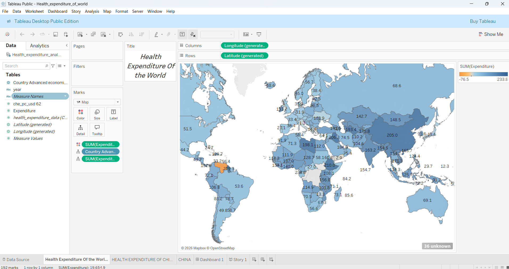
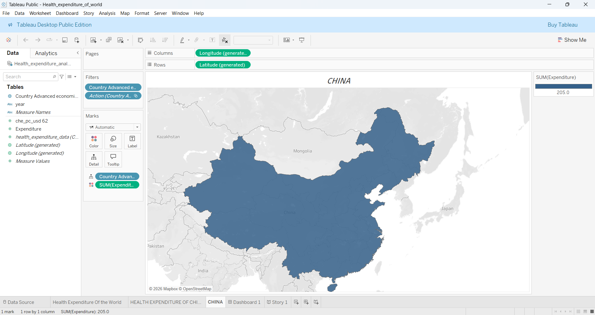
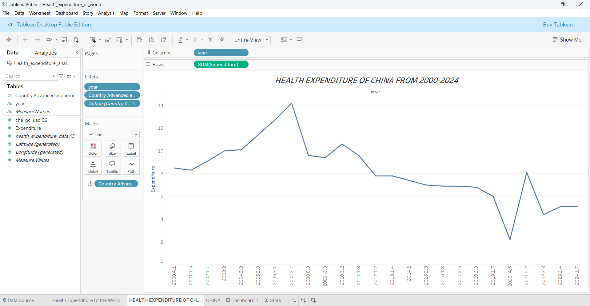
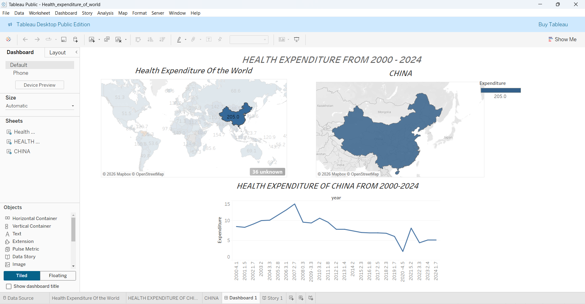
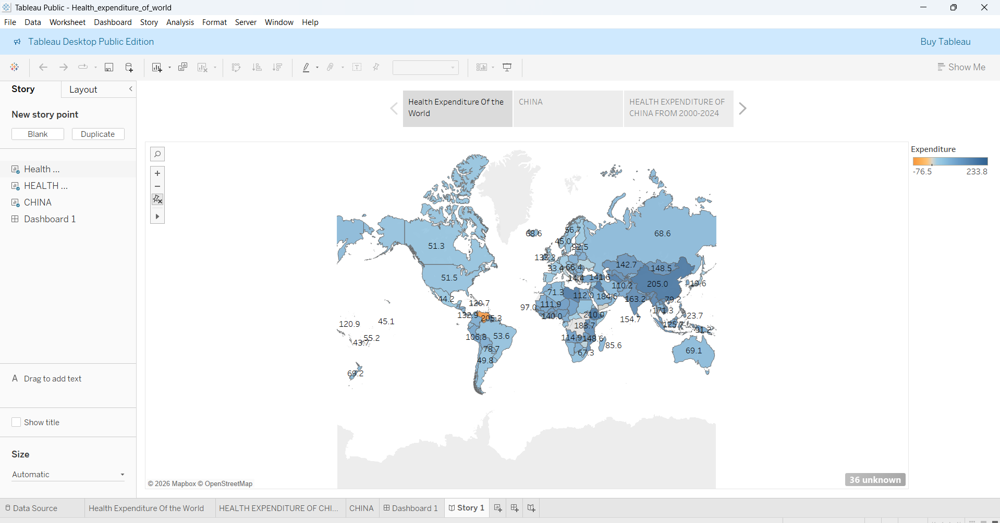

# 🌍 Global Health Expenditure Analysis (2000–2024)

## 📌 Project Overview

This project presents an interactive Tableau dashboard and story that analyze global health expenditure trends from 2000 to 2024. The solution enables users to explore healthcare spending across countries, identify expenditure patterns, compare regional investments, and evaluate long-term healthcare funding trends through interactive visualizations.

The dashboard combines geographic analysis, trend visualization, and storytelling techniques to transform complex healthcare expenditure data into actionable insights for policymakers, researchers, analysts, and decision-makers.

---

## 🎯 Business Objectives

* Analyze healthcare expenditure across countries and regions.
* Compare spending patterns and identify high- and low-expenditure nations.
* Evaluate historical healthcare investment trends from 2000–2024.
* Support data-driven decision-making through interactive visualizations.
* Deliver insights using Tableau dashboards and storytelling features.

---

## 🛠️ Tools & Technologies

* **Tableau Public**
* **Data Visualization**
* **Business Intelligence**
* **Geographic Mapping**
* **Interactive Dashboard Design**
* **Storytelling with Data**

---

## 📊 Dashboard Features

### 🌍 Global Health Expenditure Map

* Interactive world map displaying healthcare expenditure by country.
* Color gradients represent expenditure intensity.
* Enables quick comparison of healthcare investments across regions.

### 🌎 Country-Level Analysis

* Drill-down exploration for individual countries.
* Geographic visualization with expenditure metrics.
* Supports detailed country-specific analysis.

### 📈 Health Expenditure Trend Analysis (2000–2024)

* Time-series visualization of annual healthcare spending.
* Highlights expenditure growth patterns and fluctuations.
* Enables trend monitoring and historical comparisons.

### 📊 Interactive Dashboard

* Centralized view combining maps, trends, and analytical insights.
* Interactive filters and actions for customized exploration.
* User-friendly design for efficient data analysis.

### 📖 Tableau Story

* Guided narrative explaining key findings.
* Structured flow from global overview to detailed insights.
* Improves understanding through data storytelling.

---

## 🔍 Key Insights

* China recorded the highest health expenditure among countries included in the dataset.
* Significant variation exists in healthcare spending across global regions.
* Developed economies generally demonstrate higher healthcare investments.
* Long-term expenditure trends reveal evolving healthcare priorities and economic influences.
* Interactive visualizations allow deeper exploration of country-specific healthcare patterns.

---

## 📈 Business Value

This project helps:

* **Government Agencies** evaluate healthcare investment strategies.
* **Policy Makers** compare healthcare spending across nations.
* **Healthcare Researchers** identify expenditure trends and patterns.
* **Business Analysts** uncover insights from healthcare datasets.
* **Organizations** support strategic planning using data-driven decisions.

---

## 📂 Project Structure

```bash
Global-Health-Expenditure-Analysis/
│
├── Dataset/
│   └── HealthExpenditure.xlsx
│
├── Tableau Workbook/
│   └── Global_Health_Expenditure_Analysis.twb
│
├── Screenshots/
│   ├── World_Health_Expenditure_Map.png
│   ├── Country_Analysis.png
│   ├── Health_Expenditure_Trend.png
│   ├── Dashboard.png
│   └── Tableau_Story.png
│
└── README.md
```

---

## 📸 Dashboard Preview

### 🌍 Global Health Expenditure Map



### 🌎 Country Analysis



### 📈 Health Expenditure Trend Analysis



### 📊 Interactive Dashboard



### 📖 Tableau Story



---

## 🚀 How to Use

1. Download or clone the repository.
2. Open the Tableau Workbook (`.twb`) file using Tableau Desktop.
3. Explore the Global Health Expenditure Map.
4. Select countries to perform detailed analysis.
5. Analyze healthcare spending trends over time.
6. Navigate through the Tableau Story for guided insights.

---

## 💡 Skills Demonstrated

* Tableau Dashboard Development
* Data Visualization
* Business Intelligence
* Geographic Analysis
* Interactive Reporting
* Data Storytelling
* Trend Analysis
* KPI Interpretation
* Analytical Thinking
* Data-Driven Decision Making

---

## 👨‍💻 Author

**Chowdri Furkhan**

Data Analyst | Data Science Enthusiast | Power BI | Tableau | SQL | Python

---

### ⭐ Support

If you found this project valuable, consider giving the repository a **Star ⭐** and sharing your feedback.
